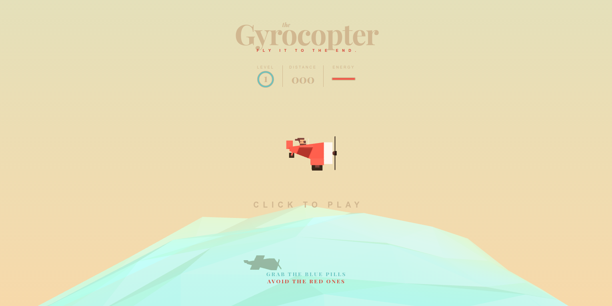

# the-gyrocopter
Mini game producted by Three.js

Inspired by following this [tutorial](http://tympanus.net/Tutorials/TheAviator/) (many thanks). I'm used [webpack](webpack.github.io) to re-structure code. Included adding something, fixing some little bugs from tutorial and enjoy.

### Usage
After cloning this repository, you need to install `webpack`.
Then open your terminal, at the root directory, run command `webpack` ( add option `--optimize-minimize` if you want to minimize code).

Or using [npm scripts](https://docs.npmjs.com/cli/run-script)
`
npm run-script build
`

Then open your browser and enjoy it.
Tested in Firefox 45.0.1, Chromium 49.0, Vivaldi 1.0.435.42 .
